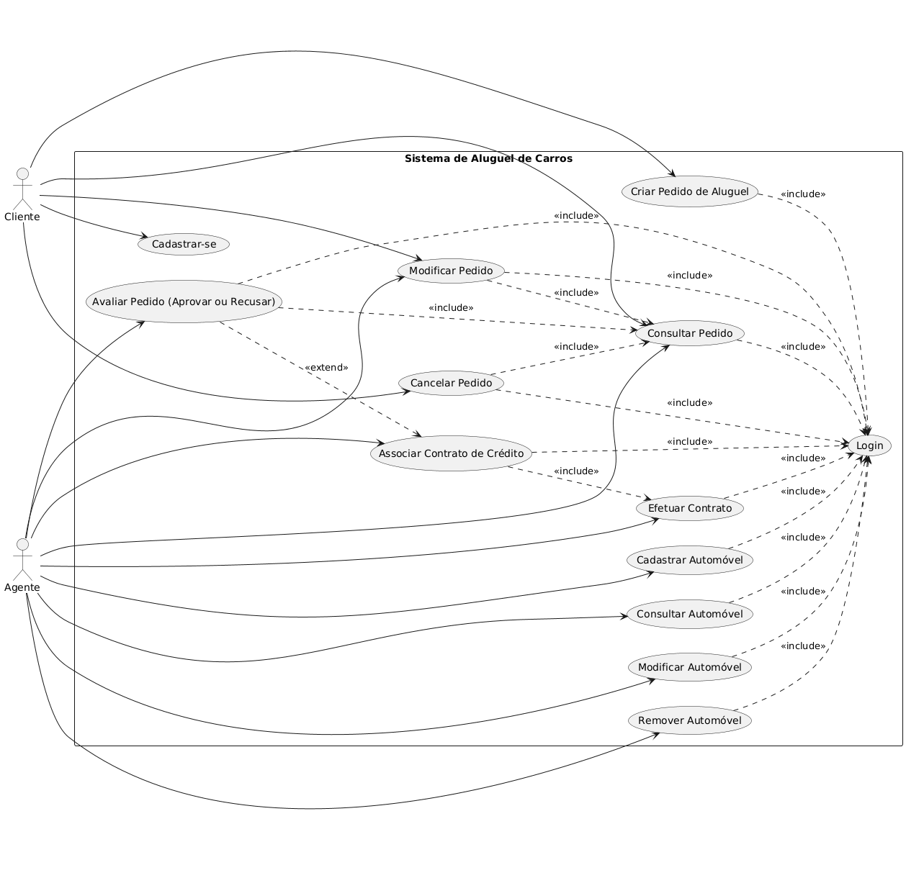

# Sistema de Aluguel de Carros

Este repositório contém o desenvolvimento de um **Sistema de Aluguel de Carros** como parte do Laboratório de Desenvolvimento de Software do curso de Engenharia de Software.

O sistema tem como objetivo apoiar a gestão de aluguéis de automóveis, permitindo que clientes e agentes (empresas e bancos) possam criar, consultar, modificar e cancelar pedidos, além de gerenciar contratos de crédito e automóveis.

---

## Funcionalidades

- Autenticação e controle de acesso.
- Cadastro e gerenciamento de:
  - Clientes (`Customer`)
  - Funcionários (`Employer`)
  - Agentes (`Agent`)
  - Veículos (`Vehicle`)
- Gestão de pedidos (`Order`) e contratos de aluguel (`Contract` e `CreditContract`).
- Painel administrativo com telas para visualizar, criar e editar registros.
- Integração com **Thymeleaf** para renderização de páginas HTML.

## Tecnologias Utilizadas

- **Java 17+**
- **Spring Boot**
  - Spring MVC
  - Spring Data JPA
  - Spring Security
- **Thymeleaf**
- **Hibernate**

## Estrutura do Projeto
```
src/
├── main/
│ ├── java/com/aluguelcarros/aluguel_carros/
│ │ ├── controller/ # Controllers REST e MVC
│ │ ├── model/ # Entidades do sistema
│ │ ├── repository/ # Interfaces JPA
│ │ ├── service/ # Regras de negócio
│ │ └── config/ # Configurações (ex: segurança)
│ └── resources/
│ ├── templates/ # Páginas HTML (Thymeleaf)
│ └── application.properties
└── test/ # Testes automatizados
```
---

## Diagramas

### Diagrama de Casos de Uso

O diagrama de casos de uso descreve as funcionalidades do sistema e os atores envolvidos:




### Diagrama de Classes

### Diagrama de Pacotes

### Diagrama de Componentes
---

## Como Executar

- Java 17+
- Maven

### Passos
1. Clone este repositório:
   ```bash
   git clone https://github.com/andre-jales/sistema-de-aluguel-de-carros
   cd sistema-de-aluguel-de-carros
   ```

2. Compile e rode a aplicação:
   ```bash
    mvn clean install
   ```

3. Execute a aplicação
   ```bash
    mvn spring-boot:run
   ```

4. Acesso no navegador
   ```bash
    http://localhost:8080
   ```

---

## Contribuição

Este repositório está sendo desenvolvido como parte do LAB02. Qualquer alteração ou atualização dos diagramas e código deve seguir as diretrizes definidas para o laboratório.

---

## Licença

Projeto acadêmico - uso apenas para fins educacionais.
